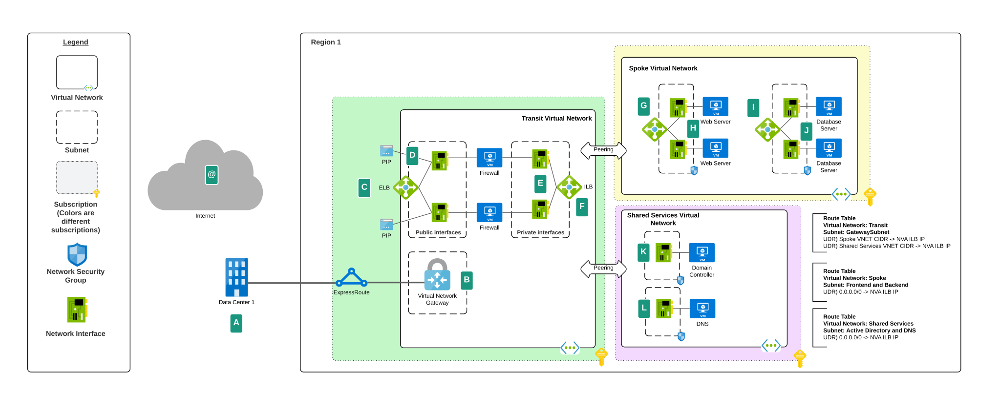
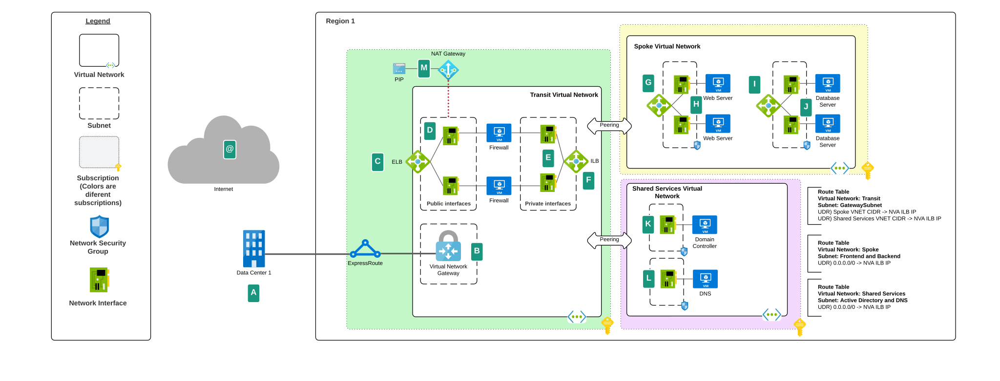
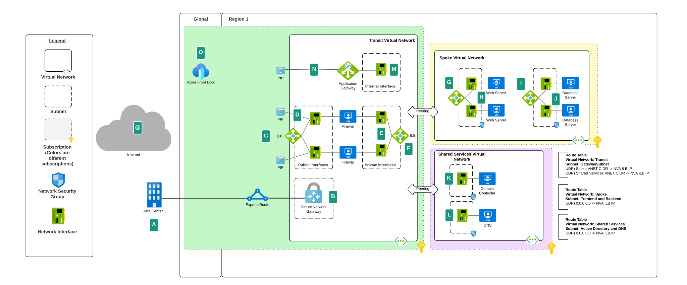
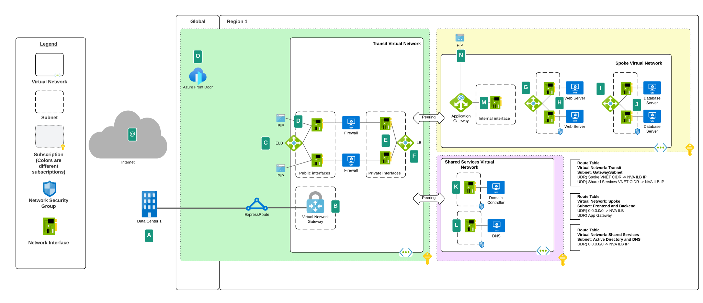
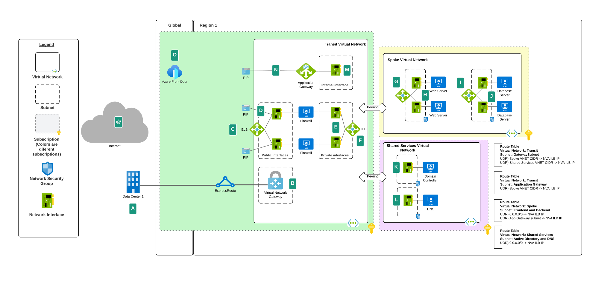
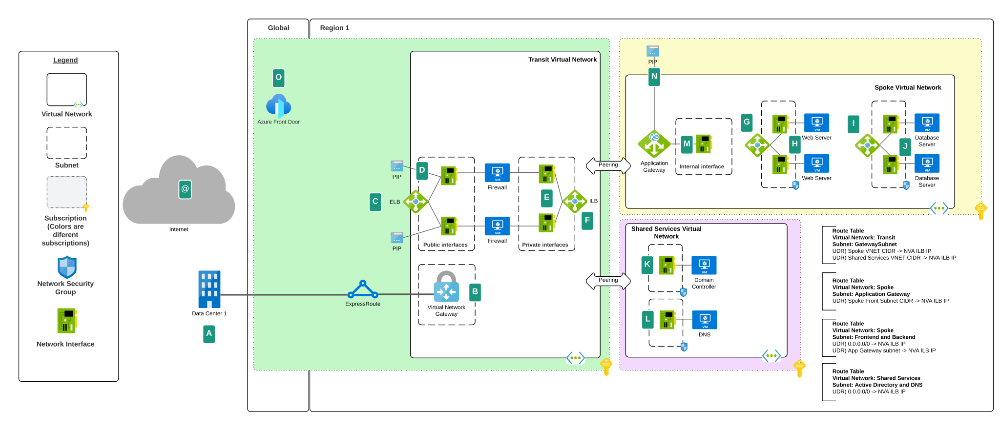
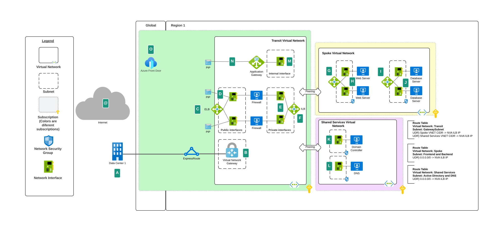
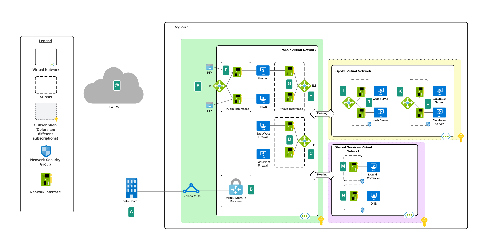
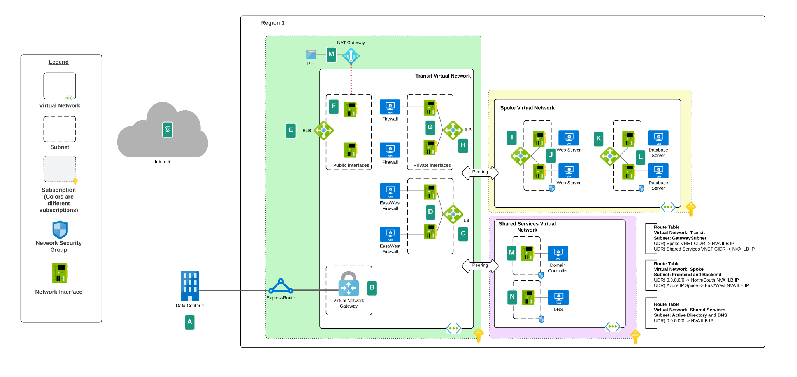
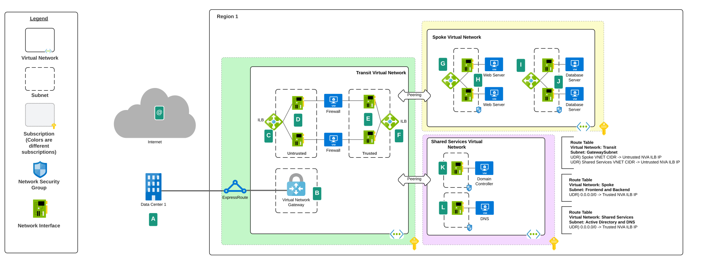

# Traffic Flows in Common Azure Networking Patterns

## Overview
A critical foundational decisions an organization will make when adopting Azure is settling on a networking architecture. 
The [Microsoft Azure Cloud Adoption Framework](https://docs.microsoft.com/en-us/azure/architecture/framework/security/design-network-segmentation) and [Azure Architecture Center](https://docs.microsoft.com/en-us/azure/architecture/) can help you to align your organizational requirements for security and operations with the appropriate architecture. While these resources do a great job explaining the benefits and considerations of each architecture, they often lack details as to how a packet gets from point A to point B. 

The traffic flows documented in this repository seek to fill this gap to provide the details of how the traffic typically flows and the options available to influence these flows to achieve security and operational goals. Additionally, they can act as a tool for learning the platform and troubleshooting issues with Azure networking.

The term NVA (network virtual appliance) is used in this repository to reference a security appliance, most commonly a next-gen firewall. NVAs will typically have a separate management interface in a dedicated management subnet which is not shown in these images.

For the purposes of this repository, north and south traffic is traffic ingressing or egressing to the Internet. East and west traffic is traffic ingressing or egressing between on-premises and Azure or between workloads running in Azure.

This respository will be continually updated to include new flows.

## Sections
* [Hub and Spoke with single NVA stack for all traffic](#hub-and-spoke-with-single-nva-stack-for-all-traffic)
  * [On-premises to Azure](#single-nva-on-premises-to-azure)
  * [Azure to Azure](#single-nva-azure-to-azure)
  * [Azure to Internet using Public IP](#single-nva-azure-to-internet-using-public-ip)
  * [Azure to Internet using NAT Gateway](#single-nva-azure-to-internet-using-nat-gateway)
  * [Internet to Azure with HTTP/HTTPS Traffic Option 1](#single-nva-internet-to-azure-http-and-https-option-1)
  * [Internet to Azure with HTTP/HTTPS Traffic Option 2](#single-nva-internet-to-azure-http-and-https-option-2)
  * [Internet to Azure with HTTP/HTTPS Traffic with IDS IPS Option 1](#single-nva-internet-to-azure-http-and-https-with-ids-ips-option-1)
  * [Internet to Azure with HTTP/HTTPS Traffic with IDS IPS Option 2](#single-nva-internet-to-azure-http-and-https-with-ids-ips-option-2)
  * [Internet to Azure Non HTTP/HTTPS Traffic](#single-nva-internet-to-azure-non-http-and-https)
* [Hub and Spoke with separate NVA stacks for east/west and north/south traffic](#hub-and-spoke-with-separate-nva-stacks)
  * [Azure to Azure](#dual-nva-azure-to-azure)
  * [Azure to Internet using Public IP](#dual-nva-azure-to-internet-using-public-ip)
  * [Azure to Internet using NAT Gateway](#dual-nva-azure-to-internet-using-nat-gateway)
* [Hub and Spoke with single NVA stack for all traffic and NVA has dual NICs](#hub-and-spoke-with-single-nva-using-two-network-interfaces-for-private-traffic)
  * [On-premises to Azure](#single-nva-with-dual-nics-on-premises-to-azure)
* Hub and Spoke with single NVA stack for all traffic in multiple regions
  * Azure to Azure

## Hub and Spoke with Single NVA Stack for all traffic
The patterns in this section assume the organization is deploying a single NVA stack that will handle north/south and east/west traffic. Each NVA is configured with three network interfaces. The first interface handles private traffic (to and from on-premises to Azure or within Azure). The second interface handles public traffic (to and from the Internet). The third interface, which is not pictured in these images, is used for management of the NVA.

### Single NVA On-premises to Azure
Scenario: Machine on-premises initiates a connection to an application running in Azure.

| Step | Path  | Description |
| ------------- | ------------- | ------------- |
| 1 | A -> B | Machine traffic passes over ExpressRoute circuit to Virtual Network Gateway |
| 2 | B -> F  | User defined route in route table assigned to GatewaySubnet directs traffic to internal load balancer for NVA |
| 3 | F -> E | Internal load balancer passes traffic to private interface for NVA |
| 4 | E -> G | NVA evaluates its rules, allows traffic, and passes it to internal load balancer for frontend application |
| 5 | G -> H | Internal load balancer for frontend application passes traffic to frontend application virtual machine |
| 6 | H -> F | User defined route in route table assigned to frontend subnet directs traffic to internal load balancer for NVA |
| 7 | F -> E | Internal load balancer passes traffic to originating NVA's private interface to preserve traffic symmetry |
| 8 | E -> B | NVA passes traffic to Virtual Network Gateway 
| 9 | B -> A | Virtual Network Gateway passes traffic over ExpressRoute circuit back to machine on-premises |

### Single NVA Azure to Azure
Scenario: Virtual machine in one spoke initiates connection to virtual machine in another spoke.

| Step | Path  | Description |
| ------------- | ------------- | ------------- |
| 1 | H -> F | User defined route in route table assigned to frontend subnet directs traffic to internal load balancer for NVA |
| 2 | F -> E | Internal load balancer passes traffic to NVA's private interface |
| 3 | E -> K | NVA evaluates its rules, allows traffic, and passes it to Active Directory domain controller virtual machine |
| 4 | K -> F | User defined route in route table assigned to domain controller subnet directs traffic to internal load balancer for NVA |
| 5 | F -> E | Internal load balancer passes traffic to originating NVA's private interface to preserve traffic symmetry | 
| 6 | E -> H | NVA passes traffic back to frontend virtual machine |

### Single NVA Azure to Internet using Public IP
Scenario: Virtual machine in Azure initiates a connection to a third-party website on the Internet and the NVA is configured with public IPs.

| Step | Path  | Description |
| ------------- | ------------- | ------------- |
| 1 | H -> F | User defined route in route table assigned to frontend subnet directs traffic to internal load balancer for NVA |
| 2 | F -> E | Internal load balancer passes traffic to NVA's private interface |
| 3 | E -> D | NVA evaluates its rules, allows traffic, routes to its public interface  |
| 4 | D -> @ | Public interface NATs to its public IP and traffic is routed over the Internet to the third-party website | 
| 5 | @ -> D | Third-party website passes traffic back to public IP of NVA's public interface |
| 6 | D -> E | NVA passes traffic rom its public interface to its private interface |
| 7 | E -> H | NVA passes traffic back to frontend virtual machine |

### Single NVA Azure to Internet using NAT Gateway
Scenario: Virtual machine in Azure initiates a connection to a third-party website on the Internet and the NVAs are configured to use NAT Gateway.

| Step | Path  | Description |
| ------------- | ------------- | ------------- |
| 1 | H -> F | User defined route in route table assigned to frontend subnet directs traffic to internal load balancer for NVA |
| 2 | F -> E | Internal load balancer passes traffic to NVA's private interface |
| 3 | E -> D | NVA evaluates its rules, allows traffic, routes to its public interface |
| 4 | D -> M | Public interface routes traffic to NAT Gateway via System Route
| 5 | M -> @ | NAT Gateway NATs to its public IP and traffic is routed over the Internet to the third-party website |
| 6 | @ -> M | Third-party website passes traffic back to public IP of NAT Gateway |
| 7 | M -> D | NAT Gateway passes traffic back to NVA's public interface |
| 8 | D -> E | NVA routes traffic from its public interface to its private interface |
| 9 | E -> H | NVA passes traffic back to frontend virtual machine |

### Single NVA Internet to Azure Http and Https Option 1
Scenario: User on the Internet initiates a connection to an application running in Azure. The application has been secured behind an Application Gateway for intra-region security and application-layer load balancing. The Application Gateway is located in the transit virtual network and is provided as a centralized service to all workloads. Azure Front Door is placed in front of the Application Gateway to provide inter-region security, load balancing, and site acceleration.

Benefits of this pattern include:
* Centralized administration of the Application Gateway which may fit the operational model of organizations new to Azure
* Traffic sourced from the Internet is centrally ingressed through the transit virtual network which can be tightly controlled by central IT

Considerations of this pattern include:
* [Scale issues due to Application Gateway limits](https://github.com/MicrosoftDocs/azure-docs/blob/master/includes/application-gateway-limits.md)
* Using the Application Gateway as a shared resource also increases the blast radius for misconfigurations or failures of the Application Gateway
* Workload owner agility may also be inhibited due to more restrictive change control required by the resource being shared

| Step | Path  | Description |
| ------------- | ------------- | ------------- |
| 1 | @ -> O | User's machine sends traffic to Azure Front Door which terminates the TCP connection |
| 2 | O -> N | Azure Front Door establishes a new TCP connection with the Application Gateway's public IP and adds the user's public IP to the X-Forwarded-For header |
| 3 | N -> M | Application Gateway NATs to its private IP, appends the X-Forwarded-Header with the Azure Front Door public IP, performs its security and load balancing function |
| 4 | M -> G | Application Gateway passes traffic from its internal interface to the internal load balancer for the web frontend |
| 5 | G -> H | Internal load balancer passes traffic to the web frontend virtual machine |
| 6 | H -> M | Web frontend virtual machine passes traffic to the Application Gateway private IP |
| 7 | M -> N | Application Gateway NATs to it's public IP |
| 8 | N -> O | Application Gateway passes traffic to Azure Front Door |
| 9 | O -> @ | Azure Front Door passes traffic to user's machine

### Single NVA Internet to Azure Http and Https Option 2
Scenario: User on the Internet initiates a connection to an application running in Azure. The application has been secured behind an Application Gateway for intra-region security and load application-level balancing. The Application Gateway is located in the workload virtual network and is dedicated to the workload. Azure Front Door is placed in front of the Application Gateway to provide inter-region security, load balancing, and site acceleration.

Benefits of this pattern include:
* The blast radius for misconfigurations or failures of the Application Gateway instance are limited to the individual workload
* The reduction in risk can allow for further democratization of Azure resources providing more agility to workload owners

Considerations of this pattern include:
* Additional costs an Application Gateway per workload
* Additional costs for [DDoS Standard](https://azure.microsoft.com/en-us/pricing/details/ddos-protection/). DDoS Standard is licensed per 100 Public IPs and these IPs can be across multiple Virtual Networks in different subscriptions in the same Azure AD Tenant. Each Azure Application Gateway will consume at least one Public IP.
* Additional Azure Policy may also need to be introduced to ensure appropriate guardrails are put in place around secure configuration of Application Gateway.

| Step | Path  | Description |
| ------------- | ------------- | ------------- |
| 1 | @ -> O | User's machine sends traffic to Azure Front Door which terminates the TCP connection |
| 2 | O -> N | Azure Front Door establishes a new TCP connection with the Application Gateway's public IP and adds the user's public IP to the X-Forwarded-For header |
| 3 | N -> M | Application Gateway NATs to its private IP, appends the X-Forwarded-Header with the Azure Front Door public IP, performs its security and load balancing function |
| 4 | M -> G | Application Gateway passes traffic from its internal interface to the internal load balancer for the web frontend |
| 5 | G -> H | Internal load balancer passes traffic to the web frontend virtual machine |
| 6 | H -> M | Web frontend virtual machine passes traffic to the Application Gateway private IP |
| 7 | M -> N | Application Gateway NATs to it's public IP |
| 8 | N -> O | Application Gateway passes traffic to Azure Front Door |
| 9 | O -> @ | Azure Front Door passes traffic to user's machine

### Single NVA Internet to Azure Http and Https with IDS IPS Option 1
Scenario: User on the Internet initiates a connection to an application running in Azure. The application has been secured behind an Application Gateway for intra-region security and load balancing. The Application Gateway is located in the transit virtual network and is provided as a centralized service to all workloads. Azure Front Door is placed in front of the Application Gateway to provide inter-region security, load balancing, and site acceleration. An NVA is placed between the Application Gateway and the application to provide IDS/IPS functionality. 

Reference the [public documentation](https://docs.microsoft.com/en-us/azure/architecture/example-scenario/gateway/firewall-application-gateway) for additional ways to achieve this pattern.

Benefits of this pattern include:
* Centralized administration of the Application Gateway which may fit the operational model of organizations new to Azure
* Traffic sourced from the Internet is centrally ingressed through the transit virtual network which can be tightly controlled by central IT

Considerations of this pattern include:
* [Scale issues due to Application Gateway limits](https://github.com/MicrosoftDocs/azure-docs/blob/master/includes/application-gateway-limits.md)
* Using the Application Gateway as a shared resource also increases the blast radius for misconfigurations or failures of the Application Gateway
* Workload owner agility may also be inhibited due to more restrictive change control required by the resource being shared

| Step | Path  | Description |
| ------------- | ------------- | ------------- |
| 1 | @ -> O | User's machine sends traffic to Azure Front Door which terminates the TCP connection |
| 2 | O -> N | Azure Front Door establishes a new TCP connection with the Application Gateway's public IP and adds the user's public IP to the X-Forwarded-For header |
| 3 | N -> M | Application Gateway NATs to its private IP, appends the X-Forwarded-Header with the Azure Front Door public IP, performs its security and load balancing function |
| 4 | M -> F | User defined route in route table assigned to Application Gateway subnet directs traffic from Application Gateway internal interface to internal load balancer for NVA
| 5 | F -> E | Internal load balancer passes traffic to private interface for NVA |
| 6 | E -> G | NVA evaluates its rules, allows traffic, and passes it to internal load balancer for frontend application |
| 7 | G -> H | Internal load balancer passes traffic to the web frontend virtual machine |
| 8 | H -> F | User defined route in route table assigned to web frontend subnet directs traffic to the internal load balancer for the NVA |
| 9 | F -> E | Internal load balancer passes traffic to the NVA |
| 10 | E -> M | NVA passes traffic to the Application Gateway internal interface |
| 11 | M -> N | Application Gateway NATs to it's public IP |
| 12 | N -> O | Application Gateway passes traffic to Azure Front Door |
| 13 | O -> @ | Azure Front Door passes traffic to user's machine

### Single NVA Internet to Azure Http and Https with IDS IPS Option 2
Scenario: User on the Internet initiates a connection to an application running in Azure. The application has been secured behind an Application Gateway for intra-region security and load balancing. The Application Gateway is located in the workload virtual network and is dedicated to the workload. Azure Front Door is placed in front of the Application Gateway to provide inter-region security, load balancing, and site acceleration. An NVA is placed between the Application Gateway and the application to provide IDS/IPS functionality. 

Reference the [public documentation](https://docs.microsoft.com/en-us/azure/architecture/example-scenario/gateway/firewall-application-gateway) for additional ways to achieve this pattern.

Benefits of this pattern include:
* The blast radius for misconfigurations or failures of the Application Gateway instance are limited to the individual workload
* The reduction in risk can allow for further democratization of Azure resources providing more agility to workload owners

Considerations of this pattern include:
* Additional costs an Application Gateway per workload
* Additional costs of traffic traversing the peering to the transit virtual network
* Additional Azure Policy may also need to be introduced to ensure appropriate guardrails are put in place around secure configuration of Application Gateway.

| Step | Path  | Description |
| ------------- | ------------- | ------------- |
| 1 | @ -> O | User's machine sends traffic to Azure Front Door which terminates the TCP connection |
| 2 | O -> N | Azure Front Door establishes a new TCP connection with the Application Gateway's public IP and adds the user's public IP to the X-Forwarded-For header |
| 3 | N -> M | Application Gateway NATs to its private IP, appends the X-Forwarded-Header with the Azure Front Door public IP, performs its security and load balancing function |
| 4 | M -> F | User defined route in route table assigned to Application Gateway subnet directs traffic from Application Gateway internal interface to internal load balancer for NVA
| 5 | F -> E | Internal load balancer passes traffic to private interface for NVA |
| 6 | E -> G | NVA evaluates its rules, allows traffic, and passes it to internal load balancer for frontend application |
| 7 | G -> H | Internal load balancer passes traffic to the web frontend virtual machine |
| 8 | H -> F | User defined route in route table assigned to web frontend subnet directs traffic to the internal load balancer for the NVA |
| 9 | F -> E | Internal load balancer passes traffic to the NVA |
| 10 | E -> M | NVA passes traffic to the Application Gateway internal interface |
| 11 | M -> N | Application Gateway NATs to it's public IP |
| 12 | N -> O | Application Gateway passes traffic to Azure Front Door |
| 13 | O -> @ | Azure Front Door passes traffic to user's machine

### Single NVA Internet to Azure Non Http and Https
Scenario: User on the Internet initiates a connection to an application running in Azure. The application is served up using a protocol that IS NOT HTTP/HTTPS. An NVA is placed between the Internet and the application.

| Step | Path  | Description |
| ------------- | ------------- | ------------- |
| 1 | @ -> C | User's machine sends traffic to the public IP address of an external Azure Load Balancer |
| 2 | C -> D | External load balancer passes the traffic through the Azure software defined network which preserves the user's machine's public IP as the source and passes it on to the NVA's public interface |
| 3 | D -> E | NVA evaluates its rules, allows traffic, routes the traffic to its private interface and NATs to its private IP |
| 4 | E -> G | NVA passes traffic to the internal load balancer for the web frontend |
| 5 | G -> H | Web frontend internal load balancer passes traffic to web frontend virtual machine |
| 6 | H -> E | Web frontend virtual machine passes traffic to NVA's private interface |
| 7 | E -> D | NVA routes traffic from its private interface to its public interface
| 8 | D -> @ | NVA passes traffic back through the Azure software defined network where its source IP address is rewritten to the external load balancer's public IP

## Hub and Spoke With Separate NVA Stacks
The patterns in this section assume the organization is deploying a separate NVA stack for north/south and east/west traffic. This is done to mitigate the risk of a bottle neck or failure to north/south traffic affecting east/west traffic and vice versa.

The north/south NVAs are configured wwith three network interfaces. The first interface handles private traffic (to and from on-premises to Azure or within Azure). The second interface handles public traffic (to and from the Internet). The third interface, which is not pictured in these images, is used for management of the NVA.

The east/west NVAs are configured with two interfaces. The first interface handles payload traffic (to and from on-premises to Azure or within Azure). The second interface, which is not pictured in these images, is used for management of the NVA.

### Dual NVA Azure to Azure
Scenario: Virtual machine in one spoke initiates connection to virtual machine in another spoke.

| Step | Path  | Description |
| ------------- | ------------- | ------------- |
| 1 | A -> B | Machine traffic passes over ExpressRoute circuit to Virtual Network Gateway |
| 2 | B -> C  | User defined route in route table assigned to GatewaySubnet directs traffic to internal load balancer for east/west NVA |
| 3 | C -> D | Internal load balancer passes traffic to payload interface for east/west NVA |
| 4 | D -> I | NVA evaluates its rules, allows traffic, and passes it to internal load balancer for frontend application |
| 5 | I -> J | Internal load balancer for frontend application passes traffic to frontend application virtual machine |
| 6 | J -> C | User defined route in route table assigned to frontend subnet directs traffic to internal load balancer for east/west NVA |
| 7 | C -> D | Internal load balancer passes traffic to originating east/west NVA's payload interface to preserve traffic symmetry |
| 8 | D -> B | NVA passes traffic to Virtual Network Gateway 
| 9 | B -> A | Virtual Network Gateway passes traffic over ExpressRoute circuit back to machine on-premises |

### Dual NVA Azure to Internet using Public IP
Scenario: Virtual machine in Azure initiates a connection to a third-party website on the Internet and the NVA is configured with public IPs.

| Step | Path  | Description |
| ------------- | ------------- | ------------- |
| 1 | J -> H | User defined route in route table assigned to frontend subnet directs traffic to internal load balancer for north/south NVA |
| 2 | H -> G | Internal load balancer passes traffic to north/south NVA's private interface |
| 3 | G -> F | North/south NVA evaluates its rules, allows traffic, routes to its public interface  |
| 4 | F -> @ | Public interface NATs to its public IP and traffic is routed over the Internet to the third-party website | 
| 5 | @ -> F | Third-party website passes traffic back to public IP of north/south NVA's public interface |
| 6 | F -> G | North/south NVA routes traffic from its public interface to its private interface |
| 7 | G -> J | North/south NVA passes traffic back to frontend virtual machine |

### Dual NVA Azure to Internet using NAT Gateway
Scenario: Virtual machine in Azure initiates a connection to a third-party website on the Internet and the NVAs are configured to use NAT Gateway.

| Step | Path  | Description |
| ------------- | ------------- | ------------- |
| 1 | J -> H | User defined route in route table assigned to frontend subnet directs traffic to internal load balancer for north/south NVA |
| 2 | H -> G | Internal load balancer passes traffic to north/south NVA's private interface |
| 3 | G -> F | North/south NVA evaluates its rules, allows traffic, routes to its public interface |
| 4 | F -> M | Public interface routes traffic to NAT Gateway via System Route
| 5 | M -> @ | NAT Gateway NATs to its public IP and traffic is routed over the Internet to the third-party website |
| 6 | @ -> M | Third-party website passes traffic back to public IP of NAT Gateway |
| 7 | M -> F | NAT Gateway passes traffic back to north/south NVA's public interface |
| 8 | F -> G | North/south NVA routes traffic from its public interface to its private interface |
| 9 | G -> J | North/south NVA passes traffic back to frontend virtual machine |

## Hub and spoke with single NVA using two network interfaces for private traffic
The single pattern in this section assumes the organization is deploying a single NVA for north, south, east, and west traffic. The NVA is configured with four network interfaces. The first and second interface handle private traffic (to and from on-premises to Azure or within Azure). The third interface handles public traffic (to and from the Internet). The fourth interface is used for management of the NVA. The public and management interfaces are not pictured in these diagrams.

It should be noted that this pattern is not recommended. Microsoft recommends using a single network interface to reduce complexity and operational overhead introduced by the SNAT required in this pattern to preserve traffic symmetry between on-premises and Azure and vice-versa. This is due to the traffic traversing [separate load balancers](https://docs.microsoft.com/en-us/azure/load-balancer/distribution-mode-concepts#hash-based). [John Savill has an excellent video](https://www.youtube.com/watch?v=LrshfXfz29Y) on this topic.

The benefit of this pattern for some NVA vendor appliances is each network interface can be assigned a separate security zone within the NVA, similar to what is typically done on-premises to establish separate trusted zones at the network layer. This can provide an easier transition for operation teams who have not yet adapted their processes for cloud.

Organizations should engage their NVA vendor for guidance on this topic.

### Single NVA with Dual NICS On-Premises to Azure
Scenario: Machine on-premises initiates a connection to an application running in Azure.

| Step | Path  | Description |
| ------------- | ------------- | ------------- |
| 1 | A -> B | Machine traffic passes over ExpressRoute circuit to Virtual Network Gateway |
| 2 | B -> C  | User defined route in route table assigned to GatewaySubnet directs traffic to internal load balancer for NVA's untrusted interface
| 3 | C -> D | Internal load balancer passes traffic to untrusted interface of NVA |
| 4 | D -> E | NVA evaluates its rules, allows traffic, routes to its trusted interface |
| 5 | E -> H | NVA SNATs to its trusted interface IP and passes traffic to internal load balancer for frontend application |
| 6 | G -> H | Internal load balancer for frontend application passes traffic to frontend application virtual machine |
| 7 | H -> E | Frontend application virtual machine passes traffic directly back to NVA's trusted interface |
| 8 | E -> D | NVA routes traffic from its trusted interface to its untrusted interface
| 9 | D -> B | NVA passes traffic to Virtual Network Gateway 
| 10 | B -> A | Virtual Network Gateway passes traffic over ExpressRoute circuit back to machine on-premises |